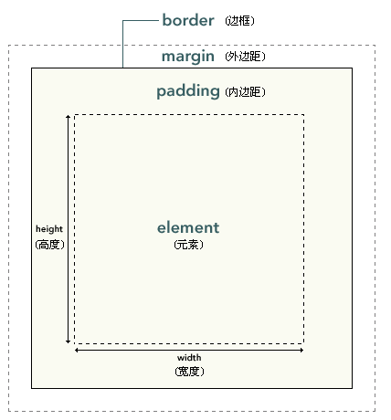

##CSS 学习笔记

[css 学习进度](http://www.w3school.com.cn/css/css_image_gallery.asp)

###2016-12-23

开头：

- 直接对应 html 标签
- `class` 以 `.` 开头
- `id` 以 `#`

注：class 可以定义多个块，id 是唯一的

派生选择器允许根据文档的上下文关系来确定某个标签的样式。比如希望列表中的 strong 元素变为斜体字，而不是通常的粗体字，可以这样定义一个派生选择器：

	li strong {
		font-style: italic;
		font-weight: normal;
	}

这样，只有 li 元素中的 strong 元素样式为斜体字，无需为 strong 元素定义特别的 class 或 id。

id 选择器可以为标有特定 id 的 HTML 元素指定特定的样式。id 选择器以 `#` 来定义。

类选择器以 `.` 显示

元素也可以基于它们的类而被选择，例如

	td.fancy{
		color: #f60;
		background: #666;
	}
	//上例中，类名为 fancy 的表格单元将是带有灰色背景的橙色：
	<td class="fancy">

CSS 属性选择器：

- `[attribute]`：用于选择带有指定属性的元素
- `[attribute=value]`：用于选取带有指定属性和值得元素
- `[attribute~=value]`：用于选取属性值中包含指定词汇的元素
- `[attribute!=value]`：用于选取带有以指定值开头的属性值的元素，该值必须是整个单词
- `[atrribute^=value]`：匹配属性值以指定值开头的每个元素
- `[attribute$=value]`：匹配属性值以指定值结尾的每个元素
- `[attribute*=value]`：匹配属性值中包含指定值的每个元素

插入外部样式表：

	<head>
		<link rel="stylesheet" type="text/css" href="style.css" />
	</head>

如果某些属性在不同的样式表中被同样的选择器定义，那么属性值将从更具体的样式表中被继承过来。

`background-color` 不能继承，其默认值是 transparent。

设置一个背景图像：

	p.flower {background-image: url(images/pic.png);}

`background-image` 也不能继承。事实上，所有背景属性都不能继承。

使用 `background-repeat` 对背景图像进行平铺。属性值 repeat 导致图像在水平垂直方向上都平铺，repeat-x 和 repeat-y 分别导致图像只在水平或垂直方向上重复，no-repeat 则不允许图像在任何方向上平铺。

为 `background-position` 属性提供值有很多方法。首先可以使用一些关键字：top、bottom、left、right 和 center。通常，这些关键字会成对出现，不过也不总是这样。还可以使用长度值，如 100px 或 5cm，最后也可以使用百分数值。不同类型的值对于背景图像的放置稍有差异。

可以通过 `background-attachment` 属性防止图像滚动。通过这个属性，可以声明图像相对于可视区是固定的(fixed)，因此不会受到滚动的影响。例如

	body {
		background-image: url(images/pic.png);
		background-repeat: no-repeat;
		background-attachment: fixed;
	}

px to em 公式转换：1 / 父元素的 font-size * 需要转换的像素值 = em 值

<em> 标签告诉浏览器把其中的文本表示为强调的内容。

CSS 提供 `text-indent`  属性实现文本缩进。

`word-spacing` 属性可以改变（单词）之间的标准间隔，其默认值 normal 与设置值为 0 是一样的。

`letter-spacing` 属性与 `word-spacing` 的区别在于，字母间隔修改的是字符或字母之间的间隔。

`text-transform` 属性处理文本的大小写。这个属性有 4 个值：

- none
- uppercase
- lowercase
- capitalize

默认值 none 对文本不做任何改动，将使用源文档中的原有大小写。顾名思义，uppercase 和 lowercase 将文本转换为全大写和全小写字符。最后，capitalize 只对每个单词的首字母大写。

`text-decoration` 属性有 5 个值：

- `none`
- `underline`：会对元素加下划线
- `overline`：会在文本的顶端画一个上划线
- `line-througn`：会在文本中间画一个贯穿线，等价于 HTML 中的 S 和 strike 元素
- `blink`：会让文本闪烁

去掉超链接的下划线：

	a {text-decoration: none;}

可以在一个规则中结合多种装饰。如果希望所有超链接既有下划线，又有上划线，则规则如下：

	a:link a:visited {text-decoration: underline overline;}

`white-space` 属性会影响到用户代理对源文档中的空格、换行和 tab 字符的处理。

- 当 `white-space` 属性设置为 `normal` 时，会合并所有的空白符，并忽略换行符。
- 当 `white-space` 属性设置为 `pre` 时，浏览器不会合并空白符，也不会忽略换行符。
- 与之相对的值是 `nowrap`，它会防止元素中的文本换行，除非使用了一个 `br` 元素。
- 如果元素的 `white-space` 设置为 `pre-wrap`，那么该元素中的文本会保留空白符序列，但是文本行会正常地换行。如果设置为这个值，源文本中的行分隔符以及生成的行分隔符也会保留。`pre-line` 与 `pre-wrap` 相反，会像正常文本中一样合并空白符序列，但保留换行符。

`font-style` 属性有三个值：

- `normal`：文本正常显示
- `italic`：文本斜体显示
- `oblique`：文本倾斜显示

链接的四种状态：

- `a:link`：普通的、未被访问的链接
- `a:visited`：用户已访问的链接
- `a:hover`：鼠标指针位于链接的上方
- `a:active`：链接被点击的时刻

修改用于列表项的标志类型，使用属性 `list-style-type`：

	ul {list-style-type: square}

利用 `list-style-image` 属性对各标志使用一个图像：

	ul li {list-style-image: url(xxx.gif)}

利用 `list-style-position` 确定标志出现在列表项内容之外还是内容内部。可以将以上 3 各样式属性合并为一个方便的属性：`list-style`，如下：

	 li {list-style: url(example.gif) square inside}

`border-collapse` 属性设置是否将表格边框折叠为单一边框：

	table {
		border-collapse: collapse;
	}
	table, th, td {
		border: 1px solid black;
	}

 

`padding` 属性定义元素边框与元素内容之间的空白区域，可以按照上右下左的顺序分别设置各边的内边距，各边距可以使用不同的单位或百分比值：

	h1 {
		padding-top: 10px;
		padding-right: 0.25em;
		padding-bottom: 2ex;
		padding-left: 20%; //父元素的20%
	}

`border-style` 定义边框样式，也是按照上右下左的顺序。

`border-width` 属性指定边框宽度，可以指定长度，比如 2px 或 0.1em，或者使用关键字, thin, medium, thick。

`border-style` 默认值是 none，如果没有声明样式，就相当于 `border-style:none`。

设置外边距的最简单的方法就是使用 margin 属性，这个属性接受任何长度单位、百分数甚至负值。

外边距合并指的是，当两个垂直外边距相遇时，它们将形成一个外边距。合并后的外边距的高度等于两个发生合并的外边距的高度中的较大者。

div、h1 或 p 元素常被称为块级元素，意味着这些元素显示为一块内容，即 ”块框“。与之相反，span 和 strong 等元素称为 ”行内元素“。

position 属性：

- static：元素框正常生成。块级元素生成一个矩形框，作为文档流的一部分，行内元素则会创建一个或多个行框，置于其父元素中。
- relative：元素框偏移某个距离。元素仍保持其未定位前的形状，它原本所占的空间仍保留。
- absolute：元素框从文档流完全删除，并相对于其包含块定位。包含块可能是文档中的另一个元素或者是初始包含块。元素原先在正常文档流中所占的空间会关闭，就好像元素原来不存在一样。元素定位后生成一个块级框，而不论原来它在正常流中生成何种类型的框。
- fixed：元素框的表现类似于将 position 设置为 absolute，不过其包含块是视窗本身

浮动的框可以向左或向右移动，直到它的外边缘碰到包含框或另一个浮动框的边框为止。由于浮动框不在文档的普通流中，所以文档的普通流中的块框表现得就像浮动框不存在一样。

通配选择器(universal selector)，显示为一个星号 `*`。该选择器可以与任何元素匹配，就像是一个通配符。

一个 class 值可以包含一个词列表，各个词之间用空格分隔。例如：

	

	Balabala
	

	.important {font-weight: bold;}
	.warning {font-style: italic;}
	.important.warning {background: silver;}

通过把两个类选择器链接接在一起，仅可以选择包含这些类名的元素（类名的顺序不限）

id 选择器不能结合使用，因为 id 属性不允许有以空格分隔的词列表。

属性选择器可以根据元素的属性及属性值来选择元素。属性与属性值必须完全匹配。

子串匹配属性选择器：

- `[abc^="def"]`：选择 abc 属性值以 ”def“ 开头的所有元素
- `[abc$="def"]`：选择 abc 属性值以 ”def“ 结尾的所有元素
- `[abc*="def"]`：选择 abc 属性值中包含子串 ”def“ 的所有元素

后代选择器(descendant selector) 又称为包含选择器。后代选择器可以选择作为某元素后代的元素。

子元素选择器(child selectors) 只能选择作为某元素子元素的元素。比如：`h1 > strong {color:red;}`

相邻兄弟选择器(adjacent sibling selector) 可选择紧接在另一个元素后的元素，且二者有相同父元素。例如：`h1 + p {margin-top:50px;}`

- `:active`: 向被激活的元素添加样式
- `:focus`: 向拥有键盘输入焦点的元素添加样式
- `:hover`: 当鼠标悬浮在元素上方时，向元素添加样式
- `:link`: 向未被访问的链接添加样式
- `:visited`: 向已被访问的链接添加样式
- `:first-child`: 向元素的第一个子元素添加样式
- `:lang`: 向带有指定 lang 属性的元素添加样式

去掉列表的的圆点：`ul {list-style-type:none;}`

构建水平导航栏的方法之一是将 <li> 元素规定为行内元素：`li {display:inline;}`

###2016-12-28

css 选择器不能缩写，不是并集，必须要写完整，比如：

	header a:linked, a:visited {...}

其中逗号后的 `a:visited` 会是全局样式，如果要只限于 header，选择器必须写全，如下：

	header a:linked, header a:visited {...}

